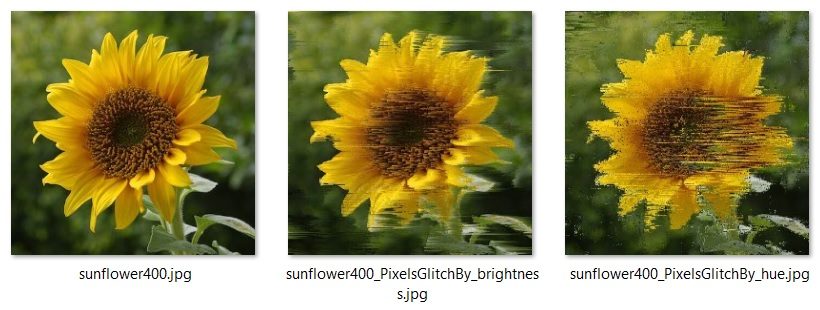

# PixelGlitch
Image glitch visualization using various Pixel Sorting methods for Processing v3. This is a by-product from [my pixel sorting library](https://github.com/volfegan/PixelSorting). I also included some external library sketches and all the credits and original source to their work is given in the source code and here.

\- \- \-

#### Basic setup and config
Most of the processing sketches have the following common variables to control the visualization and sorting. Some sketches have their own option variables and they are at the start of the sketch with instruction with their meaning.

* boolean showBothIMG -> can be either "true" or "false"; If true, it shows both imgs side by side, otherwise it only shows the sorted img with the original image in the corner reduced to 20% the size. If the image is bigger than the device's screen, it will rescale the image to 80% of the screen.
* String sortPixelMethod -> can be either "hue" or "brightness". As the name sugests the user can select how to sort the pixels by hue or brightness
* int glitchLevel -> each sorter has its own range of values. This is used to control intensity of glitch. More details are found on each individual method example.
* int multiStep -> each sorter has its own value. This is used to control speed of sorting process. For each frame, the process will run a  multiStep times.

\- \- \-

Bellow the examples on how each glitch visualization method operates. I wrote a brief explanation of how each algorithm works on selecting the pixels and glitch an image. The example images are a good measure of the levels of glitch and how extensive it tarnishes the picture.

|  *Personal created glitch library* |
|     :---:      |

#### Glitch by Imperfect selection Sorting
Based on [Pixel Selection Sort](https://github.com/volfegan/PixelSorting/tree/master/PixelSelectionSorting) and also as inefficient as that. The selection of each pixel is not done correctly because the swap of the selected Pixel step is still inside the loop that looks for all the pixels properties. This glitches the image in a very unique way, like a wind is blowing the pixels. Since the swap of the select pixel is based on a correct measure, but only transposed for a small distance, the glitch happens on localized places across the image. For a better effect, it is necessary several passes, but the problem is that the speed of this method is the same as the selection sort. It is very, very slow and the bigger the image, it gets exponentially slow.

Below two examples of an image glitched, with the pixels either sorted by hue or brightness:

#### Glitch by Incomplete HeapSorting
Based on [Pixel Heap Sorting](https://github.com/volfegan/PixelSorting/tree/master/PixelHeapSorting). The glitchLevel range is [0, to..., 10]. The glitchLevel 0 to 9 are constructed by "heapify" the image array without doing the 1st "heapify" pass that creates the heap tree. The higher the level, more of the image is sorted, but in an incomplete form. The glitchLevel 10 is done by only doing the 1st "heapify" pass and not finishing the sorting, and that gives the tree-like appearance to image repeating itself.

Sorted by Hue:

Sorted by Brightness:

#### Glitch by Incomplete Merge Sorting
Based on [Pixel Merge Sorting](https://github.com/volfegan/PixelSorting/tree/master/PixelMergeSorting). No difference from a normal Merge sorting. The glitchLevel range is [1, to...] and is used to control how many division|merges are done during the sorting before stopping.

Sorted by Hue:

Sorted by Brightness:

#### Glitch by Incomplete Shell Sorting
Based on [Pixel Shell Sorting](https://github.com/volfegan/PixelSorting/tree/master/PixelShellSorting). No difference from a normal Shell sorting. The glitchLevel range is [0, to...] and is used to control the size of the max gap interval of the pixel sorting (using the variable glitch) and stopping when the gap reaches the limit given. How this Pixel Shell sorting cuts and reassemble the image depends on the image width x height and the colour hue|brightness. As a general rule, when the width is wider than the height we see the image is also being cut vertically and horizontally. For this square dimension flower, we can only see the cuts being done horizontally. 

Sorted by Hue:

Sorted by Brightness:

| *3rd party imported and modified glitch library* |
|                      :---:                       |

#### Glitch by kimasendorf/ASDFPixelSort
Based on [kimasendorf/ASDFPixelSort](https://github.com/kimasendorf/ASDFPixelSort). This program is a bit famous, so I wanted to see how  the visualization process of the glitch occur. The original program has 3 modes of pixel sorting and only does in one way (vertical (V) + horizontal (H)). I modified it so we can change the direction of the sorting in any combination of (V) and (H) sorting. This gives 12 ways of sorting differently. Since this was not made by me, the variable names are different (description below):

* boolean mode = 0|1|2 -> mode is the Pixel sorter method to be used. [0]: will select pixels by getFirstNotBlackX() and then the getNextBlackY(); [1]: sort by brightness. It getFirstBrightX() and then getNextDarkY(); [2]: sort by getFirstNotWhiteX() and then getNextWhiteY().
Threshold values to determine how the pixel sorting starts and ends:
* int blackValue = -16000000; //original -16000000
* int brightnessValue = 60; //original 60
* int whiteValue = -13000000; //original -13000000
* int glitch = 0|1|2|3 -> Determines the direction of the glitch. [0]: 2x pass -> vertical (V) + horizontal (H); [1]: 2x pass -> horizontal (H) + vertical (V); [2]: 1x pass -> horizontal (H); [3]: 1x pass -> vertical (V). When there is 2x pass the glitch gets more intense.

Sorted by mode 0, respectively glitch: H, H+V, V, V+H

Sorted by mode 1, respectively glitch: H, H+V, V, V+H

Sorted by mode 2, respectively glitch: H, H+V, V, V+H. This glitch was very discreet in this image and only affected the dark areas below the flower.

For a visual demonstration of this method, wacht this video:

[![Visualization on how kimasendorf / ASDFPixelSort glitches some Colorful Stripes img [1296x864]](https://i.ytimg.com/vi/jv1fbsZix6c/hqdefault.jpg?sqp=-oaymwEZCNACELwBSFXyq4qpAwsIARUAAIhCGAFwAQ==&rs=AOn4CLDu7StCNDOXmbhsquMM-J5BmbLezg)](https://www.youtube.com/watch?v=jv1fbsZix6c)

#### Glitch by KrabCode Noise directed pixel sorting
Based on [KrabCode Noise directed pixel sort](https://gist.github.com/KrabCode/6fe0048fb471b099563dac857b53aa32). Just a few modifications to show original image in the corner, when reseting the image will have a fade effect and able to select image from local machine.

Sketch options can be controlled by keyboard keys:
* 'k' -> save image at /capture/ folder
* 'r' -> reset to original img
* 'i' -> show smaller original image in the corner
* 'p' -> pause animation

                      o    .   _     .
                        .     (_)         o
                 o      ____            _       o
                _   ,-/   /)))  .   o  (_)   .
               (_)  \_\  ( e(     O             _
               o       \/' _/   ,_ ,  o   o    (_)
                . O    _/ (_   / _/      .  ,        o
                   o8o/    \\_/ / ,-.  ,oO8/( -TT
                  o8o8O | } }  / /   \Oo8OOo8Oo||     O
                 Oo(""o8"""""""""""""""8oo""""""")    
                _   `\`'                  `'   /'   o
               (_)    \                       /    _   .
                    O  \           _         /    (_)
              o   .     `-. .----<(o)_--. .-'
                 --------(_/------(_<_/--\_)--------hjw
            Eeeek! Can't you see I'm trying to take a bath?
            Go glitch some images and jUST come after all pixels are done.
\- \- \-

\[ all code available under MIT License - feel free to use. \]

For more resources for glitch stuff try the following libraries:

* https://github.com/jromeem/ddgk-gltch

* https://github.com/jeffThompson/PixelSorting

* https://github.com/tsulej/GenerateMe

* https://github.com/KyleNeubarth/sketch_pixelsort_smear (it does not work with processing 3 as it dependents on outdated libraries)

* https://github.com/nerrull/PixelMigration
