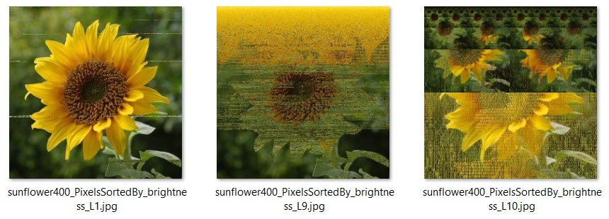
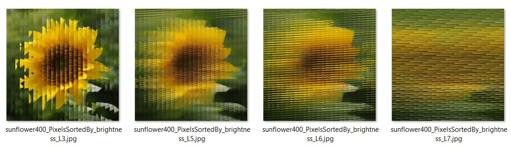
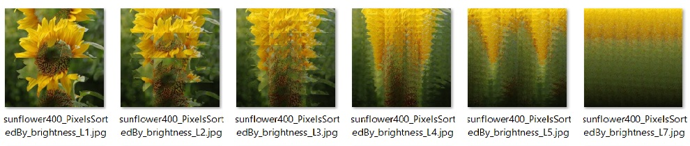
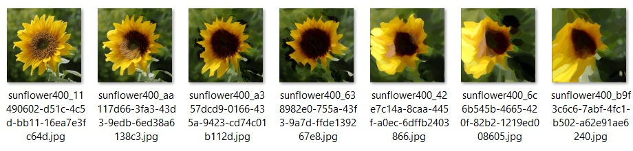
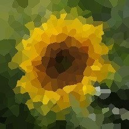
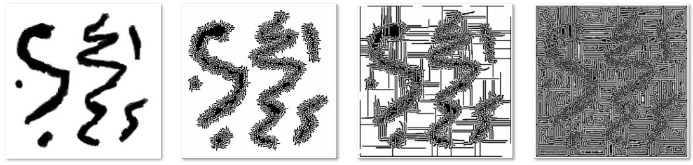
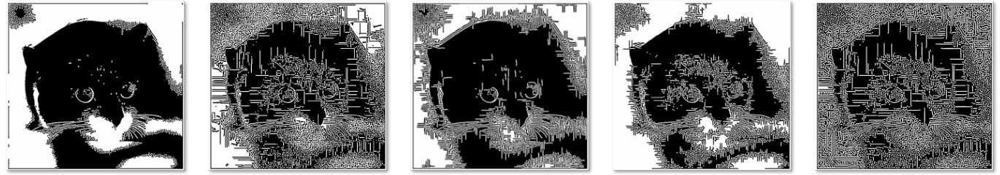

# PixelGlitch
Image glitch visualization using various Pixel Sorting methods for Processing v3. This is a by-product from [my pixel sorting library](https://github.com/volfegan/PixelSorting) and some other stuff I come by. I also included some external library sketches and all the credits and original source to their work is given here.

\- \- \-

#### Basic setup and config
Most of the processing sketches have the following common variables to control the visualization and sorting. Some sketches have their own option variables and they are at the start of the sketch with instruction with their meaning.

* boolean showBothIMG -> can be either "true" or "false"; If true, it shows both imgs side by side, otherwise it only shows the sorted img with the original image in the corner reduced to 20% the size. If the image is bigger than the device's screen, it will rescale the image to 80% of the screen.
* String sortPixelMethod -> can be either "hue" or "brightness". As the name sugests the user can select how to sort the pixels by hue or brightness
* int glitchLevel -> each sorter has its own range of values. This is used to control intensity of glitch. More details are found on each individual method example.
* int multiStep -> each sorter has its own value. This is used to control speed of sorting process. For each frame, the process will run a  multiStep times.

\- \- \-

Bellow the examples on how each glitch visualization method operates. I wrote a brief explanation of how each algorithm works on selecting the pixels and glitch an image. The example images are a good measure of the levels of glitch and how extensive it tarnishes the picture.

|  *Personal created glitch library* |
|     :---:      |

#### Glitch by Imperfect selection Sorting
Based on [Pixel Selection Sort](https://github.com/volfegan/PixelSorting/tree/master/PixelSelectionSorting) and also as inefficient as that. The selection of each pixel is not done correctly because the swap of the selected Pixel step is still inside the loop that looks for all the pixels properties. This glitches the image in a very unique way, like a wind is blowing the pixels. Since the swap of the select pixel is based on a correct measure, but only transposed for a small distance, the glitch happens on localized places across the image. For a better effect, it is necessary several passes, but the problem is that the speed of this method is the same as the selection sort. It is very, very slow and the bigger the image, it gets exponentially slow.

Below two examples of an image glitched, with the pixels either sorted by hue or brightness:

#### Glitch by Incomplete HeapSorting
Based on [Pixel Heap Sorting](https://github.com/volfegan/PixelSorting/tree/master/PixelHeapSorting). The glitchLevel range is [0, to..., 10]. The glitchLevel 0 to 9 are constructed by "heapify" the image array without doing the 1st "heapify" pass that creates the heap tree. The higher the level, more of the image is sorted, but in an incomplete form. The glitchLevel 10 is done by only doing the 1st "heapify" pass and not finishing the sorting, and that gives the tree-like appearance to image repeating itself.

Sorted by Hue:

Sorted by Brightness:

#### Glitch by Incomplete Merge Sorting
Based on [Pixel Merge Sorting](https://github.com/volfegan/PixelSorting/tree/master/PixelMergeSorting). No difference from a normal Merge sorting. The glitchLevel range is [1, to...] and is used to control how many division|merges are done during the sorting before stopping.

Sorted by Hue:

Sorted by Brightness:

#### Glitch by Incomplete Shell Sorting
Based on [Pixel Shell Sorting](https://github.com/volfegan/PixelSorting/tree/master/PixelShellSorting). No difference from a normal Shell sorting. The glitchLevel range is [0, to...] and is used to control the size of the max gap interval of the pixel sorting (using the variable glitch) and stopping when the gap reaches the limit given. How this Pixel Shell sorting cuts and reassemble the image depends on the image width x height and the colour hue|brightness. As a general rule, when the width is wider than the height we see the image is also being cut vertically and horizontally. For this square dimension flower, we can only see the cuts being done horizontally. 

Sorted by Hue:

Sorted by Brightness:

| *3rd party imported and modified glitch library* |
|                      :---:                       |

#### Glitch by kimasendorf/ASDFPixelSort
Based on [kimasendorf/ASDFPixelSort](https://github.com/kimasendorf/ASDFPixelSort). This program is a bit famous, so I wanted to see how  the visualization process of the glitch occur. The original program has 3 modes of pixel sorting and only does in one way (vertical (V) + horizontal (H)). I modified it so we can change the direction of the sorting in any combination of (V) and (H) sorting. This gives 12 ways of sorting differently. Since this was not made by me, the variable names are different (description below):

* boolean mode = 0|1|2 -> mode is the Pixel sorter method to be used. [0]: will select pixels by getFirstNotBlackX() and then the getNextBlackY(); [1]: sort by brightness. It getFirstBrightX() and then getNextDarkY(); [2]: sort by getFirstNotWhiteX() and then getNextWhiteY().
Threshold values to determine how the pixel sorting starts and ends:
* int blackValue = -16000000; //original -16000000
* int brightnessValue = 60; //original 60
* int whiteValue = -13000000; //original -13000000
* int glitch = 0|1|2|3 -> Determines the direction of the glitch. [0]: 2x pass -> vertical (V) + horizontal (H); [1]: 2x pass -> horizontal (H) + vertical (V); [2]: 1x pass -> horizontal (H); [3]: 1x pass -> vertical (V). When there is 2x pass the glitch gets more intense.

Sorted by mode 0, respectively glitch: H, H+V, V, V+H

Sorted by mode 1, respectively glitch: H, H+V, V, V+H

Sorted by mode 2, respectively glitch: H, H+V, V, V+H. This glitch was very discreet in this image and only affected the dark areas below the flower.

For a visual demonstration of this method, wacht this video:

[![Visualization on how kimasendorf / ASDFPixelSort glitches some Colorful Stripes img [1296x864]](https://i.ytimg.com/vi/jv1fbsZix6c/hqdefault.jpg?sqp=-oaymwEZCNACELwBSFXyq4qpAwsIARUAAIhCGAFwAQ==&rs=AOn4CLDu7StCNDOXmbhsquMM-J5BmbLezg)](https://www.youtube.com/watch?v=jv1fbsZix6c)

#### Glitch by KrabCode Noise directed pixel sorting
Based on [KrabCode Noise directed pixel sort](https://gist.github.com/KrabCode/6fe0048fb471b099563dac857b53aa32). Just a few modifications to show original image in the corner, when reseting the image will have a fade effect and able to select image from local machine.

Sketch options can be controlled by keyboard keys:
* 'k' -> save image at /capture/ folder
* 'r' -> reset to original img
* 'i' -> show smaller original image in the corner as a thumbnail
* 'p' -> pause animation

For a visual demonstration of this method, wacht this video:

[![Let's melt this colorful cat img [900x853] using KrabCode Noise directed pixel sorting](https://i.ytimg.com/vi/2eW6P7-Z8BI/hqdefault.jpg?sqp=-oaymwEZCNACELwBSFXyq4qpAwsIARUAAIhCGAFwAQ==&rs=AOn4CLAM8anBe_Qqq6RfH5lqMt0JO93goA)](https://www.youtube.com/watch?v=jv1fbsZix6c)

#### Glitch by KrabCode Voronoi filter
Based on [KrabCode Voronoi filter](https://gist.github.com/KrabCode/d7f2c6c938e1acd2320062a3f842d3f7). This program gets the average colour bellow each Voronoi cell and colour it. But because of the so many checks, for an image of 600x600 pixels, it was getting a maximum of 1 frame/s. So, I added a quadtree system to find the Voronoi points faster and also tweaked the checking of pixels so only half the checks are necessary; this double the animation speed but that makes the Voronoi cell pixelated. No it can reach 15 frames/s for 500 Voronoi cells. Even with 1000 Voronoi cells I can get 12 frames/s with the right divider number (controls the scan area of the QuadTree). Before the quadtree and the less checking hacking, for 500 Voronoi points and 600x600 size, on every frame it was doing 180,000,000 checks and now with the implematetions and the optimum divisor for the QuadTree scan, it is doing around 700,000 checks. This is the effect:

I used the [Coding train QuadTree template](https://github.com/CodingTrain/website/tree/master/CodingChallenges/CC_098.3_QuadTree_Collisions/Processing). The performance increase with the quadtree is gain because we only need to scan for a point in a small section of the image. I used a variable 'div' to divide the screen by that number and search the point at that location. It is important to notice that if the scan area is too small it might find no points in the area (and will start checking the entire image) and if it is too big, will need to check too many points unnecessarily. This makes the frame rate having a maximum optimum value with a single 'div' value that depends on the image screen size, number of Voronoi points and their distribution. I could write a opmimazer function that search dinamically for the best 'div' value, but let's not go crazy for a simple sketch, I'm lazy.
The main variable names are as follow:

* boolean lessChecking = true; //increase speed animation by checking only half the pixel, but pixelates
* boolean useQuadtree = true;
* boolean showQuadtree = false; //show Quadtree structure and mouse hover can scan the voronoi points (useQuadtree MUST be true to show Quadtree)
* boolean showBothIMGs = true; //to show both sources or only sorted source. Press 'i' for on|off
* int div = 15; // Divides the screen in a small rectangle to search points using Quadtree
* boolean showFrameRate = true;
* boolean showOriginalsource = true; //allows to show original image for 2s at the start of animation
* int pointCount = 500; //original 500 //How many points to create the Voronoi stuff
* private int framesToCapture = 300; // to make gifs

Sketch options can be controlled by keyboard keys:
* 'k' -> save image at /capture/ folder
* 'i' -> show smaller original image in the corner as a thumbnail
* 'p' -> pause animation
* '+' -> increase size of divisor 'div' (makes the scan area smaller)
* '-' -> decrease size of divisor 'div' (makes the scan area bigger)
* 'c' -> Enable/Disable less checking on pixels to find Voronoi points
* 's' -> show Quadtree structure and the mouse hover have a scan area to find Voronoi points
* 'q' -> Enable/Disable the use of Quadtree system
* 'f' -> show the frame rate in the upper part

For a visual demonstration of this method, wacht this video:

[![Visualization of KrabCode Voronoi filter on a colorful cat img [600x600]](https://i.ytimg.com/vi/wW7LvazCs9o/hqdefault.jpg?sqp=-oaymwEZCNACELwBSFXyq4qpAwsIARUAAIhCGAFwAQ==&rs=AOn4CLCVOcyav4oA4OSsCq0igpoyYYLu0w)](https://www.youtube.com/watch?v=wW7LvazCs9o)

#### Glitch by Low Budget Reaction-Diffusion System

Something fun I saw in the internet [reaction-diffusion system using photoshop filters](https://twitter.com/VolfeganGeist/status/1275899902237818884). I don't even know what a reaction diffusion system is (you don't need to point that for me, I'm searching the term now! [Reaction–diffusion system](https://en.wikipedia.org/wiki/Reaction%E2%80%93diffusion_system)) WTF! That is complicated, but it is possible to create a reaction diffusion system just by using these image filters:
1.[High Pass (sharpening)](https://gist.github.com/volfegan/1ab76e99883d82f05a0eac9661dd6cce) 2.[Threshold](https://gist.github.com/volfegan/ea0b336a86beea1b76885460302c7e00) 3.[Low Pass (Blur)](https://gist.github.com/volfegan/23c416801a392d17a7aaee60b01bf330).

The process can be used in any image, but it will transform it into a black & white image, but you can overlay with the original colour image for comparisons. I'm just putting here because it can 'glitch' images in a very disturbing Turing patterns. The process is slow and it can get stuck for a long period, so just use the '+' to increase the speed; it will create some pixel artifacts that will make the final result different than from the normal speed. This is the effect:

This is some examples of the various degrees of the process on this cat:

Sketch options can be controlled by keyboard keys:
* 'i' -> show smaller original image in the corner as a thumbnail
* 'o' -> overlay the original image into the processed image
* 'p' -> pause animation
* 's' -> save image at root of sketch folder
* 't' -> show the title (Reaction Diffusion System by: 1.High Pass 2.Threshold 3.Blur) and frame rate
* '+' -> increase the speed of the diffusion reaction effect, but it creates pixel artifacts
* '-' -> decrease the speed of the process

For a visual demonstration of this method, wacht this video:

(link to upload)

                      o    .   _     .
                        .     (_)         o
                 o      ____            _       o
                _   ,-/   /)))  .   o  (_)   .
               (_)  \_\  ( e(     O             _
               o       \/' _/   ,_ ,  o   o    (_)
                . O    _/ (_   / _/      .  ,        o
                   o8o/    \\_/ / ,-.  ,oO8/( -TT
                  o8o8O | } }  / /   \Oo8OOo8Oo||     O
                 Oo(""o8"""""""""""""""8oo""""""")    
                _   `\`'                  `'   /'   o
               (_)    \                       /    _   .
                    O  \           _         /    (_)
              o   .     `-. .----<(o)_--. .-'
                 --------(_/------(_<_/--\_)--------hjw
            Eeeek! Can't you see I'm trying to take a bath?
            Go glitch some images and jUST come after all pixels are done.
\- \- \-

\[ all code available under MIT License - feel free to use. \]

For more resources for glitch stuff try the following libraries:

* https://github.com/jromeem/ddgk-gltch

* https://github.com/jeffThompson/PixelSorting

* https://github.com/tsulej/GenerateMe

* https://github.com/KyleNeubarth/sketch_pixelsort_smear (it does not work with processing 3 as it dependents on outdated libraries)

* https://github.com/nerrull/PixelMigration
